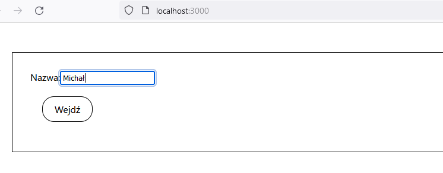

# Start the project

1. Clone the repository
2. Enter to `frontend` directory and use following command:

```
npm i --legacy-peer-deps
```

3. Enter to `backend` directory and use following command:

```
pip install -r requirements
```

4. Start backend serwer by using command (inside `backend` directory):

```
python manage.py runserver 0.0.0.0:8000
```

5. Start frontend server by using command (inside `frontend` directory):

```
npm start
```

# Screens

## Entering the login


## Messanging in chat room
