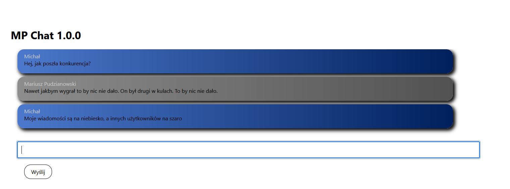

# Overview
This projects was created to have some fun with layering and channeling.
Thanks to websockets we can establish connection without unnecessary trafic and use it to build **Chat application**.
It is simple, fast and very easy to implement.
There is only one room, you just connect to frontend page, put your username there and start to use the chatroom.

## I am using: ✍
- python 🐍
- django 🚀
- react 👓
- javascript 🙆🏻‍♀️
- potentially redis but here I decided to use simples solution possible so just `channels.layers.InMemoryChannelLayer"` ¯\_(ツ)_/¯

# Start the project

1. Clone the repository
2. Enter to `frontend` directory and use following command:

```
npm i --legacy-peer-deps
```

3. Enter to `backend` directory and use following command:

```
pip install -r requirements
```

4. Start backend serwer by using command (inside `backend` directory):

```
python manage.py runserver 0.0.0.0:8000
```

5. Start frontend server by using command (inside `frontend` directory):

```
npm start
```

# Screens

## Entering the login


## Messanging in chat room
